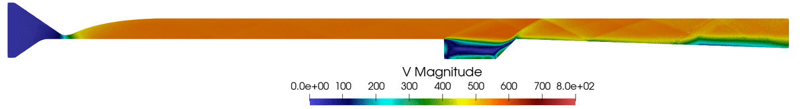

#   Scramjets

- Describe the qualitative behavior of a scramjet and distinguish it from other jet engines.
- Identify quantities in governing equations and list consequences of MIRGE-Com's assumptions.
- Distinguish experimental data collection from computer-based simulation data collection.

Much of aeronautical engineering is concerned with moving relatively heavy objects _quickly_ in atmosphere.  To this end, a number of propulsion devices have been developed or proposed over the past century, including the _jet engine_ family, in which the vehicle is propelled by reaction against thrust:

1. Chemical rocket
2. Turbojet engine
3. Ramjet engine
4. Scramjet engine

Other systems, such as propellor-driven propulsion and ion thruster engines, tend to only be practical in other circumstances (low airspeed and near-vacuum, in these cases).

Jet engines all utilize Newton's third law, typically expelling a fluid through a nozzle at high velocity to produce forward impulse.  Almost all jet engines also involve combustion (for a non-combustive rocket, consider a [Menthol–cola rocket](https://www.youtube.com/watch?v=3cY1MU0Gvjs) and the like which simply expels pressurized fluid instead).

**Chemical Rocket**.  Each of these systems conceptually builds on concepts from the one before.  For instance, the essence of a chemical rocket is that a complete oxidative combustion reaction can be efficaciously carried out in a thrust nozzle in such a way that the exhaust leads to high thrust.  Rocket engines are relatively heavy (low specific impulse) and require time- and labor-intensive refueling (if they are reusable at all).

In schematic form, a chemical rocket is not _air-breathing_ (it has no intake) but carries its own fuel and oxidizer.

**Turbojet**.  A turbojet takes incoming air, passes it through a system of stators and rotors to accelerate it to supersonic velocity, and then burns it to produce an extremely-high-velocity exhaust expelled through a rear nozzle.

https://en.wikipedia.org/wiki/Turbojet#/media/File:Jet_engine.svg

**Ramjet**.  A ramjet is a high-speed air-breathing jet engine which mixes air and fuel and emits the exhaust at supersonic speed.  A ramjet has no moving parts, instead relying on fluid dynamics to maintain its operation at speed.

https://en.wikipedia.org/wiki/Scramjet#/media/File:Turbo_ram_scramjet_comparative_diagram.svg
https://slideplayer.com/slide/14223195/

The ramjet travels at transonic or supersonic speed.  Intake air strikes the inlet and slows to subsonic velocity inside of the ramjet chamber.  The air mixes with fuel, then reaches the combustion chamber where it is ignited by the pre-existing continuous combustion

Disadvantageously, a ramjet requires additional propulsion to get up to operational speed, typically $>0.5 \textrm{Ma}$.  Ramjets also become less efficient at higher airspeeds, and are typically designed for a single airspeed and altitude combination.

Clever inlet design allows the internal airflow to remain at nearly-constant velocity even as external conditions change.

**Scramjet**.  Supersonic combustion ramjets are similar to ordinary ramjets in most operational principles, but have supersonic flow internal to the device.  This lets scramjets operate efficiently at extremely high speeds; in operational testing scramjets have run at Mach 9.8 [[ref](https://www.nasa.gov/missions/research/x43_schedule.html)] and there are plans to develop engines to run routinely up to Mach 7 [[ref](https://www.nextbigfuture.com/2011/06/aerojet-has-new-mach-7-plus-reusable.html)].

Like ramjets, scramjets require assisted flight to get up to an operational speed, in principle Mach 1 but in practice slightly higher.  The high-speed drop in ramjet efficiency motivates the adoption of the scramjet design.  Partially, this inefficiency is due to slowing intake air to lower subsonic speeds, which generates additional heat.  However, higher airflow velocity makes it difficult to maintain combustion (flame support).

https://en.wikipedia.org/wiki/Scramjet#/media/File:Specific-impulse-kk-20090105.png

Scramjets operate in two phases:  an initial warm-up phase in which the combustion and shock patterns establish, then a steady-state operating phase.  Modeling involves examining both phases in a time-dependent simulation.

- [_The Scramjet Engine:  Processes and Characteristics_](https://www.cambridge.org/core/books/scramjet-engine/introduction/FD1E8A46698975B7209A798860123969) (PDF available via UIUC library)
- ["NASA's Hypersonic Research Engine Project: A review" (NASA TM-107759)](https://ntrs.nasa.gov/citations/19950006447) (suitable for historical perspective; much work has been done in the 21st century as well)

##  Qualitative Behavior

Scramjets definitionally operate with supersonic velocities outside and inside of the device.  Supersonic inviscid flow exhibits sharp shockwaves starting at surfaces and propagating throughout the medium.  Streamlines can change discontinuously, making them relatively mathematically intractable.  "In a supersonic flow, because the local flow velocity is greater than the speed of sound, disturbances created at some point in the flow cannot work their way upstream (in contrast to subsonic flow). This property is one of the most significant physical differences between subsonic and supersonic flows. It is the basic reason why shock waves occur in supersonic flows but do not occur in steady subsonic flow."  [[Anderson, "Flight (Aerodynamics)"](https://www.sciencedirect.com/science/article/pii/B0122274105009157)]

**Warm-Up Phase**.  Precise start-up conditions vary based on the airspeed and altitude at which a scramjet is initialized.  In computer simulation, we frequently start from zero relative velocity, which is the most extreme cold case.

**Steady-State Phase**.  Eventually the flow stabilizes into a series of standing waves.  In practice, the steady state has slight fluctuations (as any real system will), but settles into something like this snapshot:

Notice the radiating static pressure waves.  These are shocks near the front, then expansion fans further to the right.  The diamond-shaped gaps between these are frequently _radical farms_, which produce and accumulate radicals important to combustion, and _ignition hotspots_.

Steady-state supersonic flows have the curious property that we can treat the $x$-dimension as analogous to a $t$ time coordinate:  that is, how far along the $x$-axis we are describes how "complete" our reacting system is.  In modeling chemical reactivity in the flow, we will take advantage of this as the so-called "reaction coordinate."

[[Urzay, "Supersonic Combustion in Air-Breathing Propulsion Systems for Hypersonic Flight"](https://web.stanford.edu/~jurzay/annurev-fluid-122316-045217.pdf), p. 610]

##  Governing Equations

Fluid flow is completely described by the Navier-Stokes equations, which define continuum hydrodynamics.  For a general conserved quantity $\varphi$, the momentum conservation equations (in cartesian form) are:

$$
\frac{ \partial \left( \rho \varphi \right) }{ \partial t }
+ \nabla \cdot \left( \rho \vec{v} \varphi \right)
= \nabla \cdot \left( \Gamma ^{\varphi} \nabla \varphi \right)
+ Q ^{\varphi} \text{,}
$$

respectively, a transient term, convective term, diffusive term, and source term.  $\Gamma$ represents the diffusive coefficient.  Recollect the physical definitions of the convective and diffusive terms:  "Convection is a physical process that occurs in a flow of gas in which some property is transported by the ordered motion of the flow.  Diffusion is a physical process that occurs in a flow of gas in which some property is transported by the random motion of the molecules of the gas."[[NASA](http://www.grc.nasa.gov/WWW/k-12/airplane/nseqs.html)]

Assuming that the foregoing equation (1) is steady-state (the transient term goes to zero) and (2) applies to a single control volume $C$, this becomes

$$
\int_{V_C} dV\, \nabla \cdot \left( \rho \vec{v} \varphi \right)
= \int_{V_C} dV\, \nabla \cdot \left( \Gamma ^{\varphi} \nabla \varphi \right)
+ \int_{V_C} dV\, Q ^{\varphi} \text{.}
$$

Finally, we apply the Gaussian divergence theorem to replace the volume integrals over the control volume by surface integrals over the control surface:

$$
\oint_{\partial V_C} d\vec{S} \cdot \nabla \cdot \left( \rho \vec{v} \varphi \right)
= \oint_{\partial V_C} d\vec{S} \cdot \left( \Gamma ^{\varphi} \nabla \varphi \right)
+ \int_{V_C} dV\, Q ^{\varphi} \text{.}
$$

The foregoing development, although evocative of fluid flow with its discussion of flux and cells, strictly limited itself to a general conserved quantity $\varphi$ in a time-independent system.  What does $\varphi$ become in a dynamic fluids simulation?

The momentum conservation equations (in cartesian form) are:

$$
\begin{align}
  \rho \left(\frac{\partial u_x}{\partial t} + u_x \frac{\partial u_x}{\partial x} + u_y \frac{\partial u_x}{\partial y} + u_z \frac{\partial u_x}{\partial z}\right)
    =& -\frac{\partial p}{\partial x} + \mu \left(\frac{\partial^2 u_x}{\partial x^2} + \frac{\partial^2 u_x}{\partial y^2} + \frac{\partial^2 u_x}{\partial z^2}\right) \\
    & - \mu \frac{\partial}{\partial x} \left( \frac{\partial u_x}{\partial x} + \frac{\partial u_y}{\partial y} + \frac{\partial u_z}{\partial z} \right) + \rho g_x \\
  \rho \left(\frac{\partial u_y}{\partial t} + u_x \frac{\partial u_y}{\partial x} + u_y \frac{\partial u_y}{\partial y}+ u_z \frac{\partial u_y}{\partial z}\right)
    =& -\frac{\partial p}{\partial y} + \mu \left(\frac{\partial^2 u_y}{\partial x^2} + \frac{\partial^2 u_y}{\partial y^2} + \frac{\partial^2 u_y}{\partial z^2}\right) \\
    & - \mu \frac{\partial}{\partial y} \left( \frac{\partial u_x}{\partial x} + \frac{\partial u_y}{\partial y} + \frac{\partial u_z}{\partial z} \right) + \rho g_y \\
  \rho \left(\frac{\partial u_z}{\partial t} + u_x \frac{\partial u_z}{\partial x} + u_y \frac{\partial u_z}{\partial y}+ u_z \frac{\partial u_z}{\partial z}\right)
    =& -\frac{\partial p}{\partial z} + \mu \left(\frac{\partial^2 u_z}{\partial x^2} + \frac{\partial^2 u_z}{\partial y^2} + \frac{\partial^2 u_z}{\partial z^2}\right) \\
    & - \mu \frac{\partial}{\partial z} \left( \frac{\partial u_x}{\partial x} + \frac{\partial u_y}{\partial y} + \frac{\partial u_z}{\partial z} \right) + \rho g_z.
\end{align}
$$

The associated mass continuity equation is
$$
{\partial \rho \over \partial t} + {\partial (\rho u_x ) \over \partial x} + {\partial (\rho u_y) \over \partial y} + {\partial (\rho u_z) \over \partial z} = 0.
$$

(The right-hand side may be non-zero if multiple phases are involved, as this is where phase transitions express themselves mathematically.)

There are a number of matters of taste involved in this derivation, like the sign of the stress tensor, but generally this is the equation one needs to simplify and solve[[Wikipedia](https://en.wikipedia.org/wiki/Derivation_of_the_Navier%E2%80%93Stokes_equations)].

-   Which quantities appear in the Navier–Stokes equations?
-   Which quantities in the Navier–Stokes equations are conservative?  (In the pressure-based solver, the pressure field is obtained by solving a pressure equation.  In the density-based solver, the continuity equation yields a density field.  In both cases, the velocity field is obtained from the momentum equations.)

We make the following assumptions about the flow:

- supersonic (i.e. no significant transonic or subsonic pockets)
- compressible
- inviscid (frictionless, zero-viscosity)

TODO
https://slideplayer.com/slide/14223195/ slide #3

http://aerospace.utoronto.ca/pdf_files/supersonic.pdf p. 10

How good are the physical assumptions?  They're a pretty good set for scramjet engines:

- Supersonic flow requires that the external speed is quite high, probably above Mach 2.  This is a baseline assumption of operation for the scramjet so it's a valid assumption.
- Compressibility is a good assumption for flows above Mach 0.3 and shock waves can form for local velocities greater than Mach 1.  [[MAE 5420 Notes](http://mae-nas.eng.usu.edu/MAE_5420_Web/section5/section.5.5.pdf)]
- Inviscid flow is a reasonable assumption for the parabolized Navier-Stokes equations:  “the viscous terms in the marching direction (which we loosely refer to as streamwise) are negligible.”  [[Schiff & Steger, “Numerical Simulation of Steady Supersonic Viscous Flow”, NASA Technical Paper 1749](https://ntrs.nasa.gov/api/citations/19810013488/downloads/19810013488.pdf)]

##  Experimental Data

Scramjet observational data are obtained two ways:  from wind tunnel experiments and from actual flights.

Experimental observational data differ substantially from computer modeling because different quantities can be obtained from each.  A computer model possesses full state information and pointwise queries such as 3D velocity and chemical composition can be trivially queried.  In contrast, experimental data must be carefully acquired and carefully interpreted.

types of experimental data

HIFiRE-3
TODO

We will discuss experimental data in more detail in “Verification & Validation and Software Quality”.

##  Challenges

> While scramjets are conceptually simple, actual implementation is limited by extreme technical challenges. Hypersonic flight within the atmosphere generates immense drag, and temperatures found on the aircraft and within the engine can be much greater than that of the surrounding air. Maintaining combustion in the supersonic flow presents additional challenges, as the fuel must be injected, mixed, ignited, and burned within milliseconds. Fuel mixing, along with the configuration and positioning of the injectors and the boundary conditions, play a key role in combustion efficiency. [[Gerdroodbary, _Scramjets: Fuel Mixing and Injection Systems_](https://www.sciencedirect.com/book/9780128211380/scramjets)]

Practical challenges to producing and operating scramjets include:

- autoignition of the internal flow ("like lighting a match in a hurricane")
- fuel–oxidizer mixing
- developing heat-dissipative refractory materials
- obtaining experimental data
  - acquiring high-grade internal flow state
  - visualizing phenomena such as shock waves

##  MIRGE-Com

You should download and install MIRGE-Com and Emirge (the operating environment for MIRGE-Com) on a system you will have regular access to.  Consult with your mentor as need be.  You will need access to a Unix-compatible operating system:  Linux, macOS, and Windows Subsystem for Linux are all reasonable choices.  We will also arrange cluster access for you to use in working on MIRGE-Com.

- [[Emirge](https://github.com/illinois-ceesd/emirge)]

MIRGE-Com is in active development.  Expect to pull the base branch you are working on frequently in order to stay up-to-date as new features come online.

If you are unfamiliar with Git and GitHub, please consult this lesson to obtain a working idea of their operation:

- [[Software Carpentry, “Version Control with Git”](https://swcarpentry.github.io/git-novice/)]

##  Exercises

_Our “homework” exercises won't be for credit; we aim for them to be sufficiently enlightening as to be worth your time in completing them._

TODO

1.  Plot $\frac{T}{\dot{m_a}}$ and $\frac{T}{\dot{m_a}a_0}$ v. Mach number $M$ from 1 to 5.
2.  Plot TSFC v. Mach number $M$ from 1 to 5.
3.  Plot Isp v. Mach number $M from 1 to 5.
4.  Plot thermal, propulsive, and overall efficiency v. Mach number $M$ from 1 to 5.

- $Q_R = 48,000 \,\text{kJ}/\text{kg}$ for _n_-decane
- 55,500 methane
- 141,800 hydrogen

maximum combustion 2000 K

(based on an exercise by [D R Kirk, "Hypersonic Airbreathing Engines"](https://slideplayer.com/slide/14223195/))
