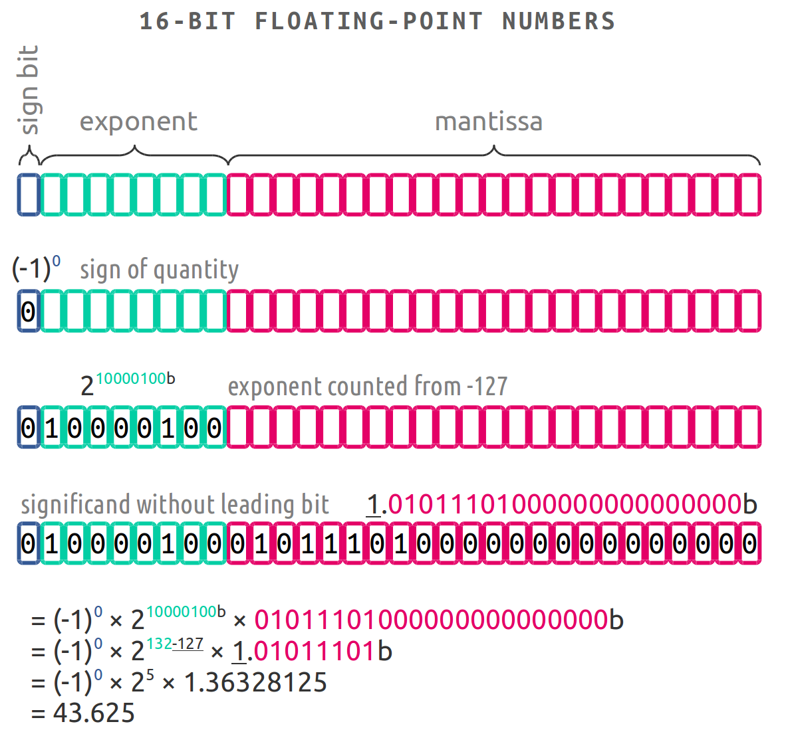

#   Transport and Flux on a Grid

- Write inter-element flux equations.
- Enumerate reasons for drift in conserved state variables.
- Diagnose transport issues for a particular mesh–element scheme.

##  Control Volumes

We have previously discussed the control volume as a defined volume-spanning unit (finite or infinitesimal) over which we may write balance equations.


If we re-examine the Navier-Stokes equations, we find that the left-hand side represents change over time (zero at steady state), while the right-hand side has terms representing material changes due to:

1. Convection (physical flow)
2. Diffusion (physical dispersal)
3. Sources & sinks (creation or destruction) (When are these appropriate?)

Every element in the grid has a corresponding balance equation, but rather than monitor at the element level, we prefer to monitor at the surface level—that is, surface flux.  (We'll come back to this in a moment.)

Even if we have source or sink terms present, we expect the entire system to remain either constant in mass and other properties, or we know the specific rate of injection or depletion of those quantities.  (For instance, a control volume drawn over a chemical rocket may lose mass over time.)

To monitor this situation, we frequently employ global balance equations, which watch for drift in the sum of state variables.  (How are these implemented in a distributed calculation?)


For instance, here are the equations describing gas dynamics in this system:

$$
\partial_t \mathbf{Q} = -\nabla\cdot{\mathbf{F}} +
(\mathbf{F}\cdot\hat{n})_{\partial\Omega} + \mathbf{S}
$$

where:

- state $\mathbf{Q} = [\rho, \rho{E}, \rho\vec{V} ]$
- flux $\mathbf{F} = [\rho\vec{V},(\rho{E} + p)\vec{V},(\rho(\vec{V}\otimes\vec{V}) + p*\mathbf{I})]$,
- domain boundary $\partial\Omega$,
- sources $\mathbf{S} = [{(\partial_t{\rho})}_s, {(\partial_t{\rho{E}})}_s, {(\partial_t{\rho\vec{V}})}_s]$

* Examine `mirgecom/euler.py:_facial_flux`.

##  Surface Flux

Finally, we apply the Gaussian divergence theorem to replace the volume integrals over the control volume by surface integrals over the control surface:

$$
\oint_{\partial V_C} d\vec{S} \cdot \nabla \cdot \left( \rho \vec{v} \varphi \right)
= \oint_{\partial V_C} d\vec{S} \cdot \left( \Gamma ^{\varphi} \nabla \varphi \right)
+ \int_{V_C} dV\, Q ^{\varphi} \text{.}
$$

This final form represents the conservative form of the PDE, and FVM focuses on efficiently solving this statement.  (This is what we mean by cell-centered FVM; LongND summarizes alternative formulations.)  There are two types of quantities represented:  surface flux terms and a volume source term.


**Figure**.  Partial differential equation terms in a finite volume cell.

### Conservative Surface Flux

The key challenge in solving the semi-discretized equation arises from the flux integration requirement over the element faces.  For simplicity, we write the convective, diffusive, and total flux terms as

$$
\begin{eqnarray}
\vec{J}^{\varphi,C} & = \rho \vec{v} \varphi \\
\vec{J}^{\varphi,D} & = - \Gamma^{\varphi} \nabla \varphi \\
\vec{J}^{\varphi}   & = \vec{J}^{\varphi,C} + \vec{J}^{\varphi,D} \text{.}
\end{eqnarray}
$$

Replace the surface integral over C by a summation of flux terms at each face:

$$
\oint_{\partial V_C} d\vec{S} \cdot \vec{J}^{\varphi}
= \sum_{\text{faces}(V_C)} \left( \int_{\text{faces}} \vec{J}^{\varphi}_{\text{face}} \right)
$$

*This result conserves quantities extremely well, the primary advantage of FVM.*

#### Quadrature

_Quadrature_ refers to numerical integration.  At the conceptually simplest end, this can simply be using something like the trapezoid rule to evaluate an integral:


The surface flux integral is typically written as a double integral over $x$ and $y$ (or whatever coordinate system is in play, such as $\phi$, $h$ for a cylindrical coordinate system).

$$
\int_{\text{face}} \vec{J}^{\varphi}_{\text{face}}
= \int dx \int dy \, \vec{J}^{\varphi}(x,y)
$$

Numericists have improved methods far beyond this point, however, such as using Richardson extrapolation to cleverly cancel error terms.  One conventional means of solution for the surface flux exploits the technique of Gaussian quadrature.  *Gaussian quadrature* integrates across the domain by evaluating the integrand at selected points and weighting the values by certain rules.  For instance, to evaluate

$$
\int_{-1}^{+1} dx \, e^{-x}
$$

with a 2-point quadrature, one calculates as follows:

| $x_i$         | $e^{-x}$ | $w_i$ | $w_i e^{-x}$ |
|---------------|----------|-------|--------------|
| $-\sqrt{1/3}$ | $0.5614$ | 1     | $0.5614$     |
| $+\sqrt{1/3}$ | $1.7813$ | 1     | $1.7813$     |
|               |          |       | $\sum_i w_i e^{-x} = 2.3427$ |

The absolute error is $2.3504 - 2.3427 = 0.0077$, and the method is far more efficient for most practical integrals than other rules of integration.  Gaussian quadrature is most appropriate when the integrand is relatively less expensive than the integration itself, which applies to many cases without analytical solutions.

A very similar technique holds for surface integration of the flux.


**Figure**.  Surface flux integration with one, two, and three quadrature points per cell face.

(If you set things up properly, your nodes in each element correspond to your numerical quadrature points!)

##  Error Sources

When we calculate a quantity numerically, we typically introduce some sort of numerical error into the result.  Frequently this is the result of either _roundoff error_, which occurs due to the finite nature of floating-point mathematics; or _truncation error_, which occurs from terms in the Taylor series of our calculation which are ignored.

### Roundoff Error

If we have an incomplete understanding of how numbers are represented on the machine, we may be surprised by certain results.  For instance, a trivial example suffices to show that something is going on:

```py
(1.1 - 0.8) == 0.3
```

To fully understand numerical error, we must first make a foray into numerical representation.  Recall that computer values like `int`s are stored as binary numbers in the machine.  If we wish to represent a fractional part, we can assign an arbitrary "binary point" (in analogy with the decimal point).


This sort of approach has major consequences.  For instance, consider the commands:

```py
print( 1.1 - 0.8 )
print( 0.3 )
print( 1.1 - 0.8 == 0.3 )
```

What happened?  If we examine the representation of each term, we can see the source of the discrepancy:

| Decimal Number | Binary Number |
| -------------- | ------------- |
| $1.1$ | `0001100110011001100110011001100110011001100110011010` |
| $0.8$ | `1001100110011001100110011001100110011001100110011010` |
| $1.1-0.8$ | `0011001100110011001100110011001100110011001100110100` |
| $0.3$ | `0011001100110011001100110011001100110011001100110011` |

So the difference of these last two quantities, expressed in binary, is `0000000000000000000000000000000000000000000000000001`!  But this is enough to prevent equality.

The right answer is to use a range, or the library functions `np.isclose` and `np.allclose` when assessing floating-point values.  _Never_ test equality on floating-point numbers.

```py
np.isclose( a, b, rtol=1e-05, atol=1e-08)
np.allclose(a, b, rtol=1e-05, atol=1e-08)
```

This is how floating-point values are _actually_ represented in the machine.  It's elegant if obscure, and mostly it is handled by the hardware.



-   [Goldberg, “What every computer scientist should know about floating-point arithmetic”](http://perso.ens-lyon.fr/jean-michel.muller/goldberg.pdf)

### Truncation Error

When we produce a finite-difference approximation, we are in essence taking a Taylor series expansion about a particular point and chopping off the higher-order terms in $h$.

$$
f(x)
\rightarrow
f(a)+\frac {f'(a)}{1!} (x-a)+ \frac{f''(a)}{2!} (x-a)^2+\frac{f'''(a)}{3!}(x-a)^3+ \cdots
\approx
f(a)+\frac {f'(a)}{1!} (x-a)+ \frac{f''(a)}{2!} (x-a)^2+O(h^3)
$$

for a second-order approximation with third-order error term.  This means that the approximate expression carries a certain amount of error, sometimes left implicit but always present:

$$
O(h^3)
=
\frac{f'''(a)}{3!}(x-a)^3+\frac{f^{(4)}(a)}{4!}(x-a)^4+\frac{f^{(5)}(a)}{5!}(x-a)^5+ \cdots
$$

Truncation error means that numerical calculations produce pseudo-physical results, or behaviors that appear to mimic physical phenomena but are not in fact real.  We call the most important of these _numerical dispersion_ and _numerical diffusion_.

Numerical dispersion arises from odd-ordered derivative terms in the truncation error.  Physical dispersion arises under circumstances where waves of a fluid do not travel at the same speed, so they separate gradually.  (This can happen due to frequency or amplitude differences.)  In some media, we expect this of waves, but numerical dispersion mimics this phenomenon incorrectly.  Physical dispersion spreads waves out.  In an analogous way, numerical dispersion will lead to phase errors (erroneous wiggles) in the solution.


Numerical diffusion arises from even-ordered derivative terms in the truncation error.  Physical diffusion will cause waves to soften, and similarly numerical diffusion will smear out and dissipate waves, in particular smoothing out sharp fronts as discontinuities.  (This is something to be attentive to in a supersonic system with shock waves present.)


The most common way to think about truncation error is that we are inexactly solving an exact expression.  It's also possible to flip the statement:  we are _exactly_ solving an _inexact_ expression.  Sometimes this latter approach is fruitful in reasoning about how and whether to worry about numerical error sources in a calculation.

- [Brewer, “Gaussian Wave Packets”](http://www.jick.net/~jess/hr/skept/GWP/)
- [Kuzmin, “Analysis of numerical dissipation and dispersion”](http://www.mathematik.tu-dortmund.de/~kuzmin/cfdintro/lecture10.pdf)

> From a practical point of view:
- an upwind discretisation scheme will have high numerical diffusion and low dispersion;
- a central or high order discretisation scheme (with no limiter) will have low numerical diffusion and high dispersion;
- a limited discretisation scheme tries to have the best of both world.

- [CFD Online Forums, “What's the difference between diffusion and dispersion?”](https://www.cfd-online.com/Forums/main/84744-what-difference-between-diffusion-dispersion.html)

##  Boundary Conditions

* Examine `mirgecom/diffusion.py:diffusion_operator` ($\nabla\cdot(\alpha\nabla u)$), `DirichletDiffusionBoundary` (specified), `NeumannDiffusionBoundary` (derivative).

* Examine `mirgecom/boundary.py:AdiabaticSlipBoundary`.
