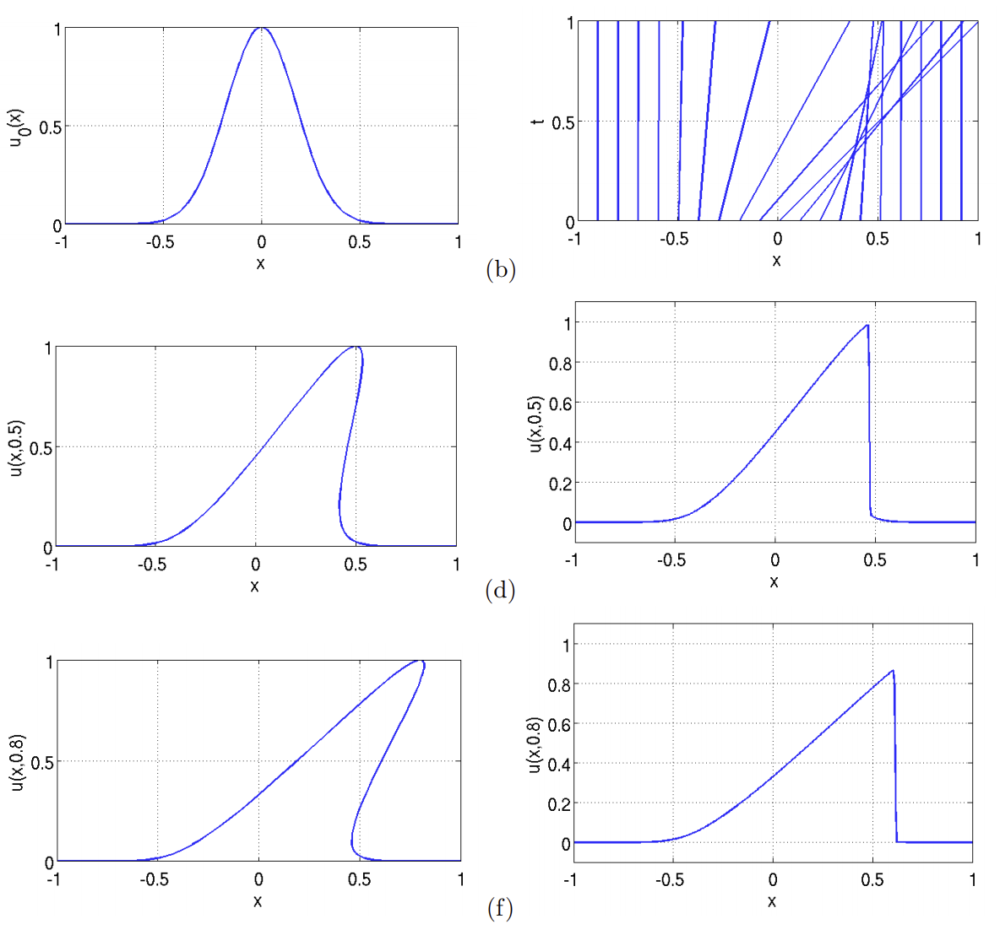

#   Shock Waves

- Describe the difficulties of modeling shock waves.

## Mathematics

A _shock wave_ occurs when the speed of transit of some mechanical phenomenon through a medium outpaces the speed of sound in that medium.

Mathematically, a shock wave is a discontinuity:  there is an instantaneous change in values across the threshold.  The phenomenon doesn't directly appear in the governing equations, but instead arises in their solution.

One way to think of this situation is that the solution “attempts” to become multi-valued:

Since a function is a map from $\mathbb{R}^{n} \rightarrow \mathbb{R}$, typical mathematical analysis would fail, and the physical reality simply becomes discontinuous and sharp.

- [Cameron, “Notes on Burgers's Equation”](https://www.math.umd.edu/~mariakc/burgers.pdf)

Salient features of mathematical interest include the angle of shocks, the consequences of increasing Mach number $M$, and the formation of the shock wave from the IVP.

Let us examine two simple differential equations that give rise to shock waves in their solutions.

## Burgers Equation

$$
\frac{\partial u}{\partial t} + u \frac{\partial u}{\partial x}
=
\nu \frac{\partial^{2} u}{\partial x^{2}}
$$

where $u$ is the speed of the fluid; and $\nu$ is the kinematic viscosity.

The solution is

$$
u(x,t)
=
\frac{u_\textrm{R} + u_\textrm{L}}{2} - \frac{u_\textrm{R} + u_\textrm{L}}{2} \tanh \left( \frac{\left( \left( x-x_0 \right) - s \, t \right)\left( u_\textrm{R} + u_\textrm{L} \right)}{4 \nu} \right)
$$

where $s\,t$ is the speed of the traveling wave; and $u_\textrm{R}$ and $u_\textrm{L}$ represent the velocity at positive and negative infinity, $u_\textrm{L} > u_\textrm{R}$ (details at Cameron).

## Sod's Problem

Sod's problem represents a shock tube with varying fluid viscosities, commonly used as a test of numerical solvers.

> One of the standard tests for numerical schemes simulating the Euler equations is the Sod shock tube problem. This is a simple one-dimensional setup that is initialised with a single discontinuity in the density and energy density. It then develops a left-going rarefaction wave, a right-going shock and a somewhat slower right-going contact discontinuity. The advantage of the Sod Shock Tube is that it has an analytical solution that can be compared against.

The right-hand side of the fluid equation is simply the Euler operator,

$$
- \nabla \dot
$$

The IVP setup is given by

$$
\begin{array}
{\rho}(x < x_0, 0) &= \rho_l \\
{\rho}(x > x_0, 0) &= \rho_r \\
{\rho}{V_x}(x, 0) &= 0 \\
{\rho}E(x < x_0, 0) &= \frac{1}{\gamma - 1} \\
{\rho}E(x > x_0, 0) &= \frac{0.1}{\gamma - 1}
\end{array}
$$

- Examine `initializers.py:SodShock1D`.
- Examine `sod-mpi.py`.

- [Holger, “The Euler Equations: Sod Shock Tube”](https://www.notjustphysics.com/2020/09/the-euler-equations-sod-shock-tube/) (watch video)
- [`ibackus`, `sod-shocktube`](https://github.com/ibackus/sod-shocktube) (analytical solution implementation)
- [Ji, “Comparison and Analysis of Different Numerical Schemes in Sod’s One-dimensional Shock Tube Problems”](https://iopscience.iop.org/article/10.1088/1742-6596/1550/3/032049/pdf)

Many of the characteristics of (mathematical) shock waves are governed by the viscosity.  At the time of writing, MIRGE-Com only supports inviscid flow.  There is currently [a project to integrate artificial viscosity](https://github.com/illinois-ceesd/mirgecom/pull/213), which is used to stabilize numerics so that shock waves do not exhibit numerical dispersion and physically-spurious oscillation near the wave front.

- [“Artificial Viscosity”](https://www.sciencedirect.com/topics/mathematics/artificial-viscosity)
- [Caramana, Shashkov, Whalen, “Formulations of Artificial Viscosity for Multi-dimensional Shock Wave Computations”](https://cnls.lanl.gov/~shashkov/papers/ed_vis.pdf)

## Exercise

Reproduce the inviscid supersonic wedge problem in MIRGE-Com.

- [SU2, “Inviscid Wedge”](https://su2code.github.io/tutorials/Inviscid_Wedge/)
